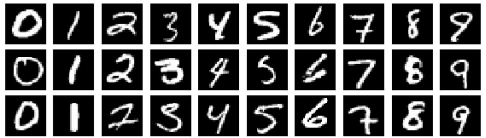

# KL-Divergence-Comparison: Bayesian Neural Networks on MNIST with and without Label Randomization

This project investigates the impact of label randomization on Bayesian neural network models trained on the MNIST dataset. The study compares KL divergence values between prior and posterior distributions for models trained with and without randomization. Two sets of models are trained: one without randomization on different subsets of MNIST samples, and another with label randomization. The goal is to analyze the effects on model uncertainty and performance. See the report for detailed discussions and results.

Key Steps:

Train classifiers without randomization on full, 200, and specific '3' and '8' MNIST samples.
Train classifiers with label randomization using the first 200 MNIST samples.
Generate random labels using a Bernoulli distribution.
Evaluate KL divergence values and discuss the findings.
## Implementation

#### Background: 
Bayesian Neural Networks (BNNs) extend traditional neural networks by treating model parameters as probability distributions rather than fixed values. This allows BNNs to capture uncertainty in predictions, crucial for robust decision-making. BNNs use techniques like Monte Carlo dropout or variational inference to approximate posterior distributions over parameters. These distributions quantify the model's uncertainty, providing richer insights into predictions. BNNs find applications in scenarios where uncertainty awareness is essential, such as in safety-critical systems, decision-making under uncertainty, and handling limited or noisy data.

#### The models:

I implemented a Bayesian Neural Network using Blitz-Bayesian with specific hyperparameters: batch size of 100, 100 epochs, and a learning rate of 0.1. The chosen batch size aligns with the number of training samples for convenience. A larger epoch number (100) aims for better generalization across different training sets. For the entire dataset, I used 10 epochs as results showed similar performance beyond that. The architecture consists of 2 convolutional layers and 3 linear layers. I employed the ADAM optimizer with a Cross Entropy loss function. Experimentation with Gradient Descent yielded inferior results.

### The Dataset

MNIST (Modified National Institute of Standards and Technology) is a widely used dataset in the field of machine learning and computer vision. It consists of a collection of 28x28 pixel grayscale images of handwritten digits (0 through 9). The dataset is commonly used for training and testing classification algorithms. MNIST serves as a benchmark for evaluating the performance of various machine learning models, particularly for image recognition tasks. Its simplicity makes it a popular starting point for beginners in the field of deep learning and pattern recognition.

### Loss Function

The cross-entropy loss function measures the dissimilarity between the true labels $y$ and the predicted probabilities $\hat {y}$ in a classification task. For each sample in a batch, it sums the negative logarithm of the predicted probability assigned to the correct class. The overall loss is the average across all samples in the batch. This function penalizes the model more when its predictions deviate from the true labels, encouraging accurate classification.

$$L(y, \hat {y})$ = -\frac{1}{N} \sum_{i=1}^{N} \sum_{j=1}^{C} y_{i,j} \log(\hat{y}_{i,j})$$

### Optimization Step

ADAM (Adaptive Moment Estimation) is a popular optimization algorithm for training deep neural networks. It combines momentum and RMSprop, adapting learning rates for each parameter. Efficient and effective, it mitigates issues like vanishing/exploding gradients, contributing to improved training in deep learning tasks.

$$\theta_{t+1} = \theta_t - \frac{\alpha}{\sqrt{\hat{v}_t} + \epsilon} \cdot \hat{m}_t $$

Where,

- $\theta_t{\text{: Parameters at time step \ t \}}$
- $\alpha{\text{: Learning Rate}}$
- $\hat{m}_t{\text{: Biased first moment estimate}}$
- $\hat{v}_t{\text{: Biased second raw moment estimat}}$
- $\epsilon{\text{: Small constant to prevent division by zero}}$

### KL Divergence

The Kullback-Leibler (KL) divergence between two probability distributions $P$ and $Q$ is given by:

$$ \ D_{\text{KL}}(P || Q) = \sum_{i} P(i) \log\left(\frac{P(i)}{Q(i)}\right) \ $$

Explanation:
- $D_{\text{KL}}(P || Q)$: KL divergence from distribution $P$ to $Q$.
- $\sum_{i}$: Sum over all possible events $i$.
- $P(i)$: Probability of event $i$ according to distribution $P$.
- $Q(i)$: Probability of event $i$ according to distribution $Q$.
- $\log$: Natural logarithm.

This formula quantifies the information gain or loss when using distribution $Q$ to approximate distribution $P$. 

## Results

1) When KL = 0, it indicates equal prior and posterior, meaning they originate from the same distribution. Notably, cases ii-v exhibit closer KL divergence results, while the entire unconstrained dataset yields higher divergence.

2) For the entire dataset, accuracy is higher, whereas constrained samples show lower accuracy.

3) In sample v, designed to demonstrate overfitting for random labels, the model achieves 100% accuracy on the training set but only 50% on the test set. This suggests overfitting, as the model memorizes the training data but fails to generalize.

4) The findings emphasize that a model can learn anything forced upon it, even if it doesn't correctly capture the true data distribution.

5) Lower KL divergence implies higher similarity between prior and posterior. The entire dataset exhibits lower similarity due to network training, with cases ii-v showing higher similarity, as expected when training on subsets of data.

